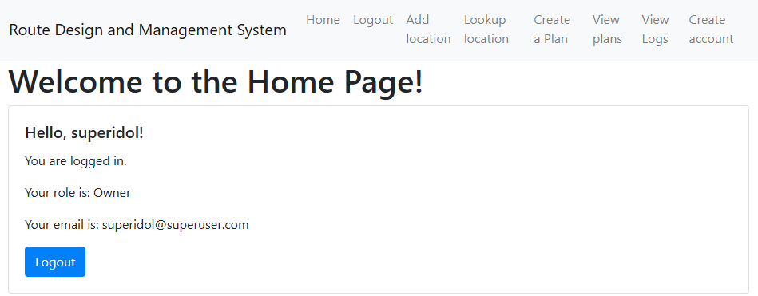
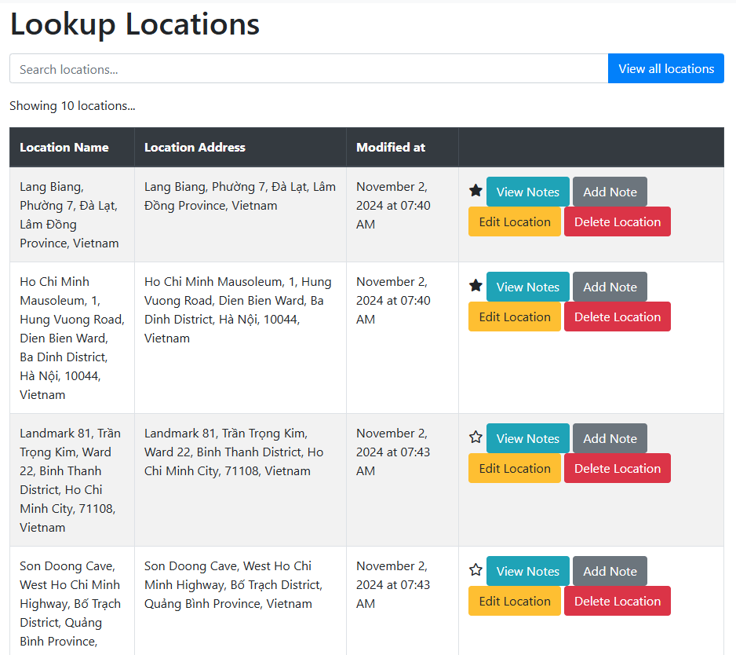

# Demonstration

<!-- markdownlint-disable MD033 MD045-->

- [Demonstration](#demonstration)
  - [Login](#login)
  - [Home screen](#home-screen)
  - [Add location screen](#add-location-screen)
  - [Look up location screen](#look-up-location-screen)
  - [Create plan](#create-plan)
  - [Logs](#logs)

## Login

<figure id="fig1">
    
    <figcaption>Login screen</figcaption>
</figure>

<figure id="fig2">
    
    <figcaption>Forgot password screen</figcaption>
</figure>

<figure id="fig3">
    
    <figcaption>Super User Create account</figcaption>
</figure>

<figure id="fig4">
    
    <figcaption>Create account recipient mail</figcaption>
</figure>

<figure id="fig5">
    
    <figcaption>Reset password</figcaption>
</figure>

## Home screen

<figure id="fig6">
    
    <figcaption>Super User Home screen</figcaption>
</figure>

## Add location screen

<figure id="fig7">
    
    <figcaption>Search and add location screen</figcaption>
</figure>

## Look up location screen

<figure id="fig8">
    
    <figcaption>Search locations default screen</figcaption>
</figure>

<figure id="fig9">
    
    <figcaption>Search locations with query "ho chi minh city"</figcaption>
</figure>

<figure id="fig10">
    
    <figcaption>View notes on a location</figcaption>
</figure>

<figure id="fig11">
    
    <figcaption>Edit location information</figcaption>
</figure>

## Create plan

<figure id="fig12">
    
    <figcaption>Create plan default screen</figcaption>
</figure>

<figure id="fig13">
    
    <figcaption>Create plan with locations and routing</figcaption>
</figure>

<figure id="fig14">
    
    <figcaption>View plans and plan info</figcaption>
</figure>

## Logs

<figure id="fig14">
    
    <figcaption>View logs</figcaption>
</figure>
